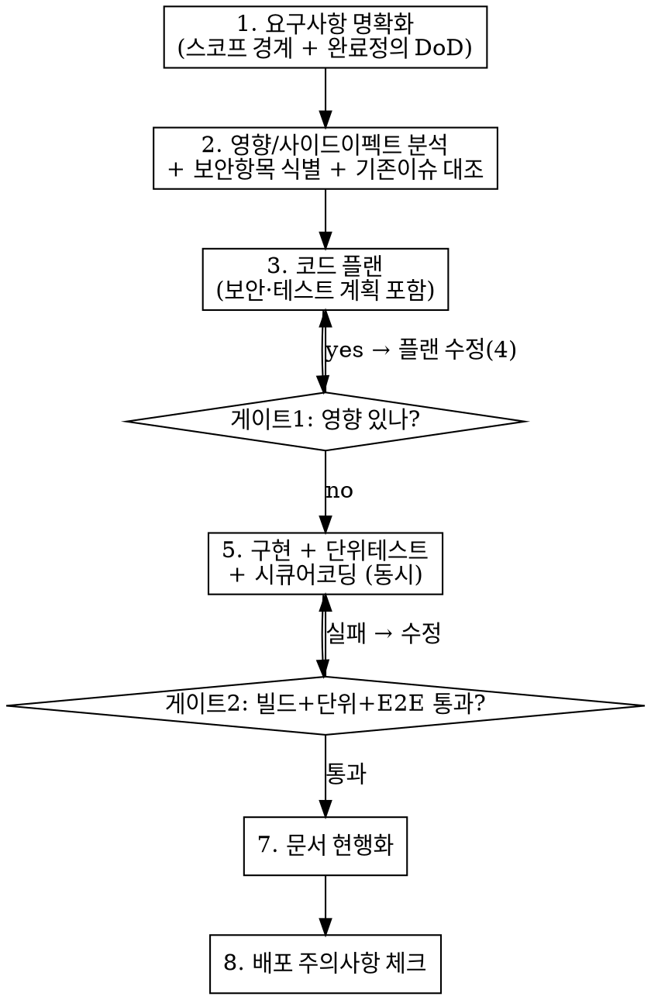

# Shipyard (기능 배포 흐름)

## Overview

**기능은 "코드를 짜는 것"이 아니라 "검증된 변경 + 현행화된 문서"로 끝난다.**
사이드 이펙트가 많은 코드베이스(공유 DB·cascade·캐시 등)에서, 코드 작성 *앞*에 영향 분석 게이트를, 문서화 *앞*에 검증 게이트를 둔다. 게이트를 건너뛰면 이 스킬을 따르는 게 아니다.

**규칙의 글자를 어기는 것은 규칙의 정신을 어기는 것이다.** "이번엔 작으니까 게이트 생략"은 위반이다.

## 0. 프로젝트 바인딩부터 읽기 (필수 첫 단계)

이 스킬은 범용 흐름이다. 구체 명령·경로는 프로젝트마다 다르므로 **시작할 때 프로젝트 바인딩을 먼저 확보한다**:

1. `.claude/shipyard.md` 가 있으면 읽는다 → 검증 명령, 헬스체크, 이슈/보안/DB/기능 문서 경로, 커밋 형식, 가드레일, 프로젝트 특이 주의사항을 거기서 가져온다.
2. 없으면 `CLAUDE.md`·빌드 스크립트·`package.json`/`build.gradle` 등에서 추론하고, **사용자에게 확인**한 뒤 `.claude/shipyard.md` 생성을 제안한다.

아래 단계에서 "검증 명령", "이슈 트래커", "보안 기준" 등은 모두 바인딩의 값을 가리킨다.

## When to Use

- 새 API / 엔드포인트 / 모듈 추가
- service·data·DTO 계층을 건드리는 동작 변경
- DB 스키마/마이그레이션 변경을 수반하는 작업
- 트래킹된 이슈 해결 작업

**When NOT to use:** 오타·주석·로그 문구 수정 같은 1파일 기계적 변경.

## 가드레일 (기본값 — 바인딩이 덮어쓸 수 있음)

명시 요청·승인 없이 Claude 가 하지 않는 것:

| 항목 | Claude | 사용자 |
|------|--------|--------|
| 코드 편집 | "구현/추가/수정" 명시 요청 시에만 | 요청 |
| git commit/push | 변경 요약 + 커밋 메시지 초안만 | 실제 커밋·푸시 |
| DB 스키마(DDL) | DDL/마이그레이션 작성 + 적용 안내 | 실제 DB 적용 |
| 서버 재시작 | 재시작 요청 | 실제 재시작 |
| 검증 실행 | 재시작 후 검증 명령 실행·판독 | — |

## The Flow (8 단계 · 게이트 2개)

게이트에서 통과 못 하면 앞 단계로 회귀한다.

### 1. 요구사항 명확화
무엇을 **하는가**와 **안 하는가**(스코프 경계) 명시. 완료 정의(DoD): 어떤 입력에 어떻게 동작하면 "끝"인지. 관련 기능 문서 먼저 읽기.

### 2. 영향 / 사이드이펙트 분석
- 호출 그래프: 진입점→service→데이터 계층, 공유 VO/DTO.
- 데이터 영향: cascade·soft delete 범위·시퀀스·스냅샷/캐시.
- **공유 자원 주의**: 공용 테이블/버킷은 내 기능 범위로 한정 (바인딩의 특이 주의사항 참조). 전체 wipe 금지.
- **보안 항목 식별**: 변경이 닿는 보안 기준 항목을 한 줄로.
- **기존 이슈 대조**: 이슈 트래커와 충돌/해결 여부.

### 3. 코드 플랜
변경 파일 목록 + 각 파일 할 일. **보안 계획**(시큐어코딩 체크리스트 매핑)과 **테스트 계획**(단위 + E2E 시나리오)을 플랜에 포함. 사후가 아니다.

### 4. 게이트1 — 영향 있으면 플랜 수정
사이드 이펙트 발견 시 3 으로 회귀. 없을 때만 구현으로.

### 5. 구현 + 단위 테스트 + 시큐어 코딩 (동시)
코드·단위테스트·보안을 같이 작성. "나중에 보안 적용"은 재작업. 프로젝트 코드 컨벤션 준수.

### 6. 게이트2 — 검증 (문서화 전 필수)
사용자에게 재시작 요청 후, 바인딩의 검증 절차로 통과 확인 (헬스체크 → 단위테스트 → E2E). **통과 못 하면 문서·버전 안 올라간다.** 원인 추적, 추측 패치 금지.

### 7. 문서 현행화 (변경된 것만)
DB 문서 / 기능 스펙 / 트러블슈팅 노트 / 이슈 트래커(해결·신규·범위변경, 카운트 드리프트 주의) / 보안 기준 / 시스템 상태(예: CLAUDE.md) + 버전 bump / git 커밋 메시지 **초안만**(바인딩의 형식).

### 8. 배포 주의사항 체크
프로젝트 배포 주의 문서 대조: 마운트/경로, DB 시퀀스, 프로파일 설정, 공유 자원 삭제 범위.

## 시큐어 코딩 체크리스트 (플랜·구현 단계에서)

- [ ] **권한**: 본인/허가된 리소스만 접근·수정 (소유권 우회 금지)
- [ ] **신원 신뢰 금지**: 사용자 식별자는 request body 가 아니라 인증 주체에서
- [ ] **입력 검증**: 스키마/타입 검증 + nested 검증 + 존재 검증
- [ ] **N+1 / 성능**: 목록·sync 조회 배치화
- [ ] **cascade/soft-delete 범위**: 의도한 행만, 공유 자원은 식별자로 한정
- [ ] 프로젝트 보안 기준(바인딩) 대조

## Common Mistakes (게이트 우회 합리화 차단)

| 합리화 | 현실 |
|--------|------|
| "변경이 작아서 영향 분석 생략" | 작은 변경이 cascade/공유자원 사고를 낸다. 2단계는 항상. |
| "보안은 나중에 한 번에" | 사후 보안은 재작업. 플랜·구현에서 같이. |
| "테스트는 코드 다 짜고" | 사후 테스트는 정당화일 뿐. 단위는 구현과, E2E 는 게이트. |
| "로컬에서 눈으로 봤으니 검증됨" | 게이트2는 재시작 후 검증 명령. 눈 확인 ≠ 통과. |
| "문서는 커밋하고 나중에" | 게이트2 통과 = 문서 현행화 포함. 코드만 끝낸 건 안 끝난 것. |
| "이슈 카운트 대충 맞겠지" | 드리프트 전례 있음. 정확히 집계. |

## Red Flags — STOP

- 영향 분석 없이 바로 코드 편집
- 사용자 "구현해줘" 없이 코드부터 수정 (가드레일 위반)
- 단위/E2E 안 돌리고 "동작할 것"
- DDL 을 Claude 가 직접 DB 에 적용 / git commit·push 를 Claude 가 실행

이 중 하나라도 보이면: 멈추고 해당 게이트로 복귀.
